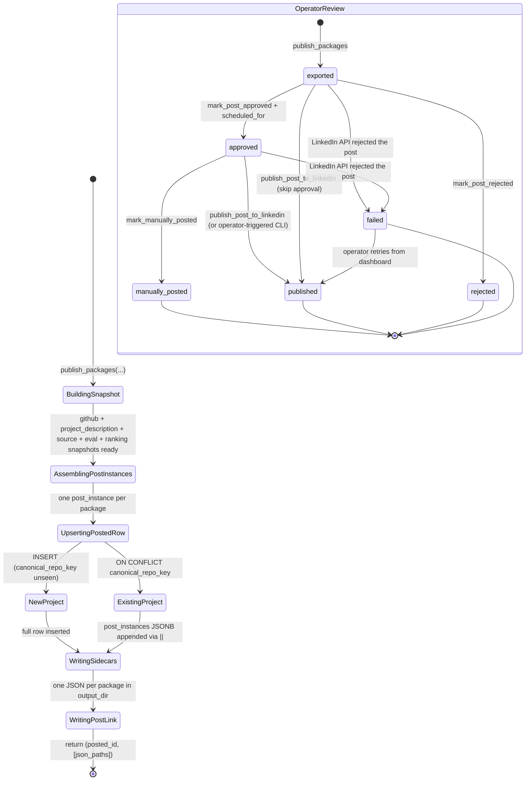
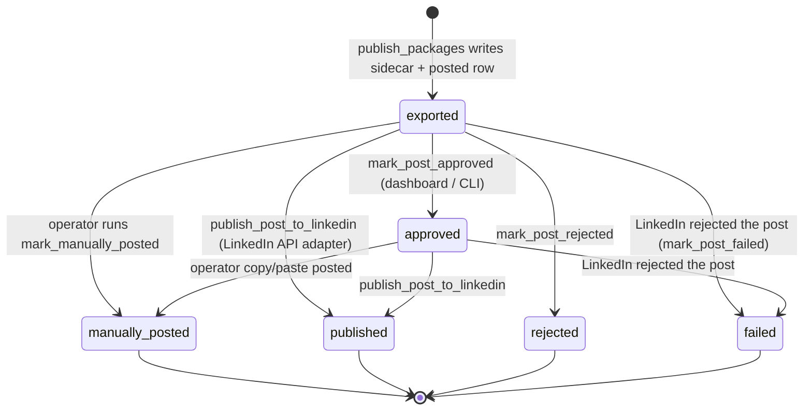

# Publishing

> *"Make the post real, then make it copy-pasteable."*

## Purpose

Publishing is the final stop in the pipeline. It takes one or more `PostPackage`s for a single winning candidate and turns them into:

1. A persistent record in `posted_repositories` — the canonical archive of what RepoRadar has produced.
2. One JSON sidecar per channel written next to the rendered image — the artifact the operator copy-pastes when manually posting.
3. A `post_link` back-reference written onto the candidate row.

The default flow is **manual export**: nothing is auto-posted to LinkedIn or Instagram. The service is designed to make adding an API publisher later straightforward without changing the rest of the pipeline.

## Source layout

```
src/publishing/
├── __init__.py
├── service.py                    # publish_packages + publish_post_to_linkedin + publish_post_to_instagram
├── repository.py                 # Owns posted_repositories table
├── image_host.py                 # S3-compatible uploader (needed for IG)
└── adapters/
    ├── manual_export.py          # default: JSON sidecar to output_dir
    ├── linkedin_api.py           # 3-step Posts API publisher
    └── instagram_graph.py        # 4-step Graph API publisher (upload → container → publish → permalink)
```

Adding a new platform = a new file under `adapters/` (e.g. `website.py`) + a `publish_post_to_<channel>` helper in `service.py`. The repository layer already supports any channel via the generic `mark_post_published` helper.

## Internal pipeline



`publish_packages` only takes the channel as far as `exported`. From there the operator chooses:

- **Approve → manually post:** `mark_post_approved` then later `mark_manually_posted` (current default for safety).
- **Approve → API publish:** `mark_post_approved` then `publish_post_to_linkedin` / `publish_post_to_instagram` (or `python -m src publish <post_id>`), which calls the channel adapter and ends in `published`.
- **Skip approval (Upload now):** the dashboard's `⤴ Upload now` button → `POST /api/posts/<post_id>/publish-now` → routes by `post_instance.platform` to the right adapter, directly on an `exported` (or `approved`) row.
- **Retry failed publish:** the `⤴ Retry upload` button on `failed` cards calls the same `publish-now` endpoint; on success the row transitions `failed → published`.
- **Reject:** `mark_post_rejected`.

The dashboard's `/api/posts/<post_id>/publish-now` (in `operator_api.web.app`) is the entry point for all of these — it loads the post_instance, dispatches to `publish_post_to_linkedin` or `publish_post_to_instagram` based on the channel, and translates exceptions into 4xx/5xx responses.

## Entry points

```python
from src.publishing import (
    publish_packages,
    publish_post_to_linkedin,
    publish_post_to_instagram,
    find_post_by_id,
    mark_post_approved,
    mark_post_rejected,
    mark_post_published,
    mark_post_failed,
    mark_manually_posted,
    LinkedInPublishError,
    InstagramPublishError,
)
from src.publishing.adapters.manual_export import export_to_disk
from src.publishing.adapters.linkedin_api import publish_to_linkedin
from src.publishing.adapters.instagram_graph import publish_to_instagram
from src.publishing.image_host import upload_image
```

| Function | Signature | Returns |
|---|---|---|
| `publish_packages` | `(conn, settings, *, candidate, evaluation, selection, packages)` | `(posted_id, [json_paths])` |
| `publish_post_to_linkedin` | `(conn, settings, *, post_id, operator='publishing_service')` | `(external_post_id, permalink)` |
| `publish_post_to_instagram` | `(conn, settings, *, post_id, operator='publishing_service')` | `(media_id, permalink)` |
| `repository.upsert_posted_repository` | `(conn, *, candidate, evaluation, selection, packages)` | `posted_id` |
| `repository.find_post_by_id` | `(conn, post_id)` | `(posted_id, post_instance) \| None` |
| `repository.mark_post_approved` | `(conn, *, post_id, scheduled_for, operator='operator')` | `bool` |
| `repository.mark_post_rejected` | `(conn, *, post_id, operator='operator', reason=None)` | `bool` |
| `repository.mark_post_published` | `(conn, *, post_id, external_post_url, external_post_id=None, operator='publishing_service')` | `bool` |
| `repository.mark_post_failed` | `(conn, *, post_id, error_message)` | `bool` |
| `repository.mark_manually_posted` | `(conn, *, posted_id, channel, external_post_url, operator='operator')` | `None` |
| `adapters.manual_export.export_to_disk` | `(package, output_dir)` | `Path` (json sidecar) |
| `adapters.linkedin_api.publish_to_linkedin` | `(package, settings)` | `(post_urn, permalink)` |
| `adapters.instagram_graph.publish_to_instagram` | `(package, settings)` | `(media_id, permalink)` |
| `image_host.upload_image` | `(settings, local_path, *, object_key)` | `str` (HTTPS URL) |

## How the service works

### `publish_packages` — the workflow

```python
def publish_packages(conn, settings, *, candidate, evaluation, selection, packages):
    posted_id = upsert_posted_repository(...)      # 1. snapshot to DB
    for package in packages:
        json_path = export_to_disk(package, ...)   # 2. write sidecar per channel
    set_post_link(conn, candidate_id=..., ...)     # 3. back-fill candidate row
    return posted_id, [json_paths]
```

Three steps, in order:

1. **Snapshot the project into `posted_repositories`.** This is where a candidate stops being "ephemeral work-in-progress" and becomes a permanent historical record. The snapshot copies the GitHub metadata, evaluation, ranking, and one `post_instances[]` entry per channel — not a reference, a copy, so months later you can still see what was posted even if the candidate row is archived or the README has changed.

2. **Write per-channel sidecars.** Each `PostPackage` becomes a JSON file in `settings.output_dir`. The file contains the full caption text, hashtags, source links, alt text, and the local path of the rendered image. This is the artifact the operator opens when posting manually.

3. **Back-fill `post_link` on the candidate row.** Closes the loop: the dashboard can now join `candidate_repository_evaluations.post_link.posted_project_id` → `posted_repositories.id` and show "this candidate became these posts".

### `posted_repositories` document shape

Per v2 design §4. One row per canonical project. Snapshots are JSONB columns:

| Column | Source |
|---|---|
| `id` | deterministic: `posted_<project_id>` |
| `project_id`, `canonical_repo_key`, `canonical_repo_url` | from the candidate |
| `github` / `hackathon` | full snapshot from the candidate's enrichment |
| `project_description` | AI summary + why_interesting + audience + tags |
| `source` | original_source_type + discovery_run_id + candidate_id + evaluation_id + selection_id |
| `evaluation_snapshot` | full `Evaluation` payload at time of selection |
| `ranking_snapshot` | ranking_version + score + rank + total_candidates + reasons |
| `post_instances` | JSONB array, one entry per channel (see below) |
| `posting_state` | has_been_posted, posted_platforms, exported_platforms, do_not_repost |
| `audit` | created_at, schema_version, created_by |

A single `post_instance` element:

```json
{
  "post_id": "post_linkedin_8f2a91d3",
  "platform": "linkedin",
  "status": "exported",
  "content": { ... full GeneratedContent ... },
  "media": [ { ... full MediaAsset ... } ],
  "source_links": ["..."],
  "review": {"approved_by": null, "approved_at": null, "review_notes": null},
  "publication": {
    "publishing_mode": "manual",
    "posted_by": null, "posted_at": null,
    "external_post_url": null, "external_post_id": null
  }
}
```

### Idempotency

`upsert_posted_repository` uses `ON CONFLICT (canonical_repo_key) DO UPDATE`. If the same canonical project is selected in a future run (operator override, repost policy change), the row is updated rather than duplicated. The crucial detail is the post_instances append:

```sql
post_instances = posted_repositories.post_instances || EXCLUDED.post_instances
```

The `||` is the JSONB array concatenation operator — new channel posts are appended rather than replacing the prior history. That preserves every post the project has ever generated.

### Manual posting → `mark_manually_posted`

When the operator actually posts (today: by hand, future: dashboard button), `mark_manually_posted(conn, posted_id=..., channel=..., external_post_url=..., operator=...)` does two atomic JSONB updates:

1. Find the matching element in `post_instances` (by `platform == channel`), set its `status` to `manually_posted`, fill in `publication.posted_at` / `external_post_url` / `posted_by`.
2. Update top-level `posting_state.has_been_posted = true`, `last_posted_at = NOW()`, and `first_posted_at = NOW()` only if it was previously null.

All done in pure SQL via `jsonb_set` + `jsonb_build_object` + `jsonb_agg` over `jsonb_array_elements` — no read-modify-write race.

### Manual export adapter

`adapters/manual_export.py::export_to_disk(package, output_dir) -> Path`:

```
output/
└── <channel>_<post_id>_<timestamp>.json    # full PostPackage as JSON
└── <channel>_<stem>_<timestamp>.jpg        # written earlier by media stage
```

The JSON includes the rendered caption text, hashtags, source links, alt text, and the local image path — everything the operator needs in one file.

### LinkedIn API adapter

`adapters/linkedin_api.py` posts one `PostPackage` to a LinkedIn **personal feed** via the versioned `/rest/posts` API. Three-step flow:

```python
def publish_to_linkedin(package: PostPackage, settings: Settings) -> tuple[str, str]:
    # 1. POST /rest/images?action=initializeUpload   → uploadUrl + image URN
    # 2. PUT  <uploadUrl> (binary JPEG bytes)         → upload
    # 3. POST /rest/posts (commentary + image URN)    → returns post URN
    return (post_urn, permalink)
```

Required `.env` for this adapter to run:

```
LINKEDIN_ACCESS_TOKEN=    # minted via Tools → OAuth Token Generator, scopes: w_member_social, openid, profile
LINKEDIN_ACTOR_URN=       # urn:li:person:<sub> from GET /v2/userinfo
LINKEDIN_API_VERSION=     # defaults to 202604 if not set; LinkedIn sunsets versions after ~12 months
```

Two CLI workflows wire this in:

```bash
python -m src publish <post_id>            # publish one exported post to LinkedIn
python -m src publish <post_id> --dry-run  # load + print the post; do not contact LinkedIn
```

Failures: the adapter raises `LinkedInPublishError` with `.status_code` and `.body` attached. `publish_post_to_linkedin` catches it, calls `mark_post_failed` to record the error on the post_instance, and re-raises so the CLI can surface it to the operator. Common cases:

| Status | What it means | Likely fix |
|---|---|---|
| 401 | Token expired or invalid | Regenerate via Tools → OAuth Token Generator |
| 403 | Missing `w_member_social` scope, or "Share on LinkedIn" product not attached | Add the product, mint a new token with all required scopes |
| 422 | LinkedIn rejected the post body | Inspect the error body; usually invalid commentary entities |
| 426 | `LINKEDIN_API_VERSION` is sunset (older than ~12 months) | Bump `LINKEDIN_API_VERSION` in `.env` or the default in `src/common/config.py` to the latest YYYYMM |

**Commentary escaping:** LinkedIn's Posts API treats `( ) < > @ * _ { } [ ] \ | ~` as entity delimiters. The adapter escapes those with `\` so plain prose with parentheses doesn't get garbled. Hashtags (`#tag`) are **not** escaped — LinkedIn parses them as real hashtags.

### Instagram Graph API adapter

`adapters/instagram_graph.py` posts one `PostPackage` to an Instagram **Business or Creator** account via the Facebook Graph API. Personal IG accounts cannot use the publishing API at all; the account must be linked to a Facebook Page that the access token's user manages.

Four-step flow:

```python
def publish_to_instagram(package: PostPackage, settings: Settings) -> tuple[str, str]:
    # 1. Upload the JPEG to a public HTTPS URL via image_host (S3-compatible)
    # 2. POST /<v>/<ig_user_id>/media?image_url=…&caption=…   → creation_id
    # 3. POST /<v>/<ig_user_id>/media_publish?creation_id=…   → media_id
    # 4. GET  /<v>/<media_id>?fields=permalink                → permalink
    return (media_id, permalink)
```

Unlike LinkedIn, Instagram does **not** accept binary uploads — the Graph API requires a publicly reachable HTTPS `image_url` for container creation. The adapter solves this by calling `src/publishing/image_host.py::upload_image` first, which writes the local JPEG to the configured S3-compatible bucket and returns the public URL.

Required `.env` for this adapter to run:

```
IG_ACCESS_TOKEN=          # long-lived Page access token (60-day expiry)
IG_BUSINESS_ACCOUNT_ID=   # IG Business account ID linked to a FB Page
IG_API_VERSION=v21.0      # Graph API version, default v21.0

# Image hosting — Instagram needs an HTTPS image_url
IMAGE_HOST_ENDPOINT=          # e.g. https://<id>.r2.cloudflarestorage.com; blank for AWS S3
IMAGE_HOST_BUCKET=
IMAGE_HOST_REGION=auto        # 'auto' for R2; AWS region for S3
IMAGE_HOST_PUBLIC_BASE_URL=   # HTTPS prefix where uploaded objects are served
IMAGE_HOST_ACCESS_KEY=
IMAGE_HOST_SECRET_KEY=
```

Token scopes required: `instagram_basic`, `instagram_content_publish`, `pages_show_list`, `pages_read_engagement`, `business_management`.

Same CLI workflow as LinkedIn:

```bash
python -m src publish <post_id>            # routes by channel — instagram or linkedin
python -m src publish <post_id> --dry-run  # load + print; do not contact any API
```

Failures: the adapter raises `InstagramPublishError` with `.status_code` and `.body` attached. `publish_post_to_instagram` catches it, calls `mark_post_failed` to record the error on the post_instance, and re-raises. Common cases:

| Status | What it means | Likely fix |
|---|---|---|
| 400 | Bad request — usually image_url not HTTPS/reachable, caption too long (>2200 chars), aspect ratio outside 4:5..1.91:1, or IG account not Business/Creator | Verify image URL is publicly reachable; convert account to Business/Creator in IG app |
| 401 | Token expired / revoked | Regenerate the long-lived Page token from Meta's Graph Explorer |
| 403 | Missing required scope, or IG account isn't linked to a Page the token's user manages | Re-grant scopes via OAuth, ensure Page→IG link is set up |
| 404 | Wrong `IG_BUSINESS_ACCOUNT_ID`, or container expired (24h limit between create and publish) | Double-check the ID; rerun publish immediately after container create |
| 429 | Rate limit — 25 publishes / 24h / account | Wait, then retry |

**Image hosting note:** `image_host.py` lazy-imports `boto3`. The first IG publish in a fresh venv will fail with a clear `ImageHostError` if boto3 isn't installed (`pip install boto3`). LinkedIn publishing is unaffected — it doesn't go through this path.

## Data ownership

Publishing is the **only** writer of `posted_repositories`. It is also the only service permitted to write the `post_link` JSONB section on a `candidate_repository_evaluations` row (the narrow exception to Candidate Intelligence's table-level ownership).

| Table / column | Operation | When |
|---|---|---|
| `posted_repositories.*` | INSERT / UPDATE | `publish_packages` |
| `posted_repositories.post_instances[].status` | UPDATE via JSONB | `mark_manually_posted` |
| `posted_repositories.posting_state` | UPDATE | `mark_manually_posted` |
| `candidate_repository_evaluations.post_link` | UPDATE | end of `publish_packages` |

Read access:
- `operator_api.web.queries.get_recent_posts` reads `posted_repositories` to populate the dashboard.
- `candidate_intelligence.repository.already_posted_keys` reads `posted_repositories.canonical_repo_key` to compute the dedup set for discovery.

## How other services interact

| Caller | What it calls | Why |
|---|---|---|
| `orchestrator.pipeline.run_pipeline` | `publish_packages` | Final stage of the daily workflow |
| Operator (future dashboard) | `mark_manually_posted` | Mark a channel as posted after copy-pasting |
| `candidate_intelligence.repository.already_posted_keys` | reads `posted_repositories.canonical_repo_key` | Filters future discovery |
| `operator_api.web.queries.get_recent_posts` | reads `posted_repositories` | Dashboard rendering |

Publishing itself does not call any other service — it's the terminal node of the pipeline.

## Post lifecycle (per channel)



States the schema allows but Publishing does not currently transition to: `drafted`, `ready_for_review` (set by Content Generation), `regenerate_requested`, `archived`.

## Configuration knobs

From `Settings`:

| Setting | Default | Effect |
|---|---|---|
| `output_dir` | `output/` | Where sidecar JSONs are written |
| `database_url` | (required) | Supabase Postgres connection string |
| `linkedin_access_token` | `None` | Bearer token for `publish_post_to_linkedin`. Without it, the adapter raises `LinkedInPublishError` |
| `linkedin_actor_urn` | `None` | `urn:li:person:<sub>` — the author of every API post |
| `linkedin_api_version` | `"202604"` | YYYYMM pin for the `LinkedIn-Version` header. Bump roughly once a year — LinkedIn returns HTTP 426 once a version is sunset. The Posts/Images API skips some months (e.g. `202512`, `202605` are not active), so don't assume the latest YYYYMM works — probe with curl first |
| `linkedin_client_id` / `linkedin_client_secret` | `None` | Reserved for future token-refresh flow; not used by the publish call itself |
| `ig_access_token` | `None` | Long-lived Page token for `publish_post_to_instagram`. Without it, the adapter raises `InstagramPublishError` |
| `ig_business_account_id` | `None` | IG Business account ID — addressed as `/{ig_user_id}/media` in the Graph API |
| `ig_api_version` | `"v21.0"` | Graph API version pin. Newer versions are released ~quarterly |
| `image_host_endpoint` | `None` | S3-compatible endpoint URL. Blank for AWS S3, set for R2/B2 |
| `image_host_bucket` | `None` | Bucket name for image uploads |
| `image_host_region` | `"auto"` | `"auto"` for R2; AWS region for S3 |
| `image_host_public_base_url` | `None` | HTTPS URL prefix where uploaded objects are served (must be reachable by Facebook's servers) |
| `image_host_access_key` / `image_host_secret_key` | `None` | S3 credentials |

## Failure handling

- **Sidecar write fails:** raises through to the orchestrator, which marks the run failed. The DB upsert may have already succeeded — the next attempt with the same `canonical_repo_key` will be a no-op append because of the `ON CONFLICT` clause.
- **DB upsert fails:** raises immediately, no sidecar gets written.
- **Partial channel publish:** if one channel's sidecar write fails after another's succeeded, the run is marked failed but the operator can still see exported sidecars in `output/`. The DB row has both channels in `post_instances` so resuming is straightforward.
- **LinkedIn API rejects the post:** the adapter raises `LinkedInPublishError`. `publish_post_to_linkedin` catches it, calls `mark_post_failed(post_id, error_message)` (sets `status='failed'` + writes `publication.error_message`), then re-raises. The CLI prints the LinkedIn response body so the operator sees what LinkedIn said.

## Out of scope today

- **Auto-publish at pipeline time.** Today `publish_packages` only takes the post as far as `exported`. To auto-publish on every run, call `publish_post_to_linkedin` / `publish_post_to_instagram` from the orchestrator after `publish_packages` returns — gated by a per-channel `auto_publish` Setting.
- **Other API publishers.** `adapters/website.py` (and similar) is not implemented. Pattern is identical: add the adapter file, wire `publish_post_to_<channel>` in `service.py`, and reuse `mark_post_published` / `mark_post_failed`.
- **LinkedIn token refresh.** `LINKEDIN_CLIENT_ID` / `LINKEDIN_CLIENT_SECRET` are read into Settings but unused. When the token expires, the adapter returns 401 — the operator regenerates manually via Tools → OAuth Token Generator. A proper refresh flow would call `POST /oauth/v2/accessToken` with a `refresh_token` grant.
- **Instagram token refresh.** `IG_APP_ID` / `IG_APP_SECRET` are read into Settings but unused. Long-lived Page tokens last ~60 days; refresh would call `GET /<v>/oauth/access_token?grant_type=fb_exchange_token`. The adapter returns 401 today and the operator regenerates manually via Graph Explorer.
- **Company page posting on LinkedIn.** Now supported — set `LINKEDIN_ACTOR_URN=urn:li:organization:<id>` and mint a token with `w_organization_social` scope. The adapter is URN-form-agnostic.
- **Image host abstraction.** Today only S3-compatible is wired. To add ImgBB / Imgur / a local Flask host, refactor `image_host.py` into a strategy interface — the IG adapter only depends on `upload_image(settings, path, object_key) -> str`.
- **Repost policy.** `posting_state.do_not_repost` is always set to `true` and read by `candidate_intelligence.source_adapters` via `already_posted_keys`. There's no manual override yet.
- **Cost accounting.** Per-post LLM + image API spend is logged to `api_calls` by the AI Gateway but not summarized per `posted_id`.
